# Assignment 01

## Descrizione di Pool

Per lo sviluppo dell'applicazione si è adottato un design basato sull'MVC.

### Comunicazione View-Model

In particolare le classi il model e la view comunicano facendo uso di ViewModel che ha ogni metodo `syncronized` per evitare corse critiche tra view e model che sono su due thread separati. Anche se in questa implementazione in particolare del programma le corse critiche non potrebbero comunque avvenire perché il model chiama update dal viewModel che fa partire il render della view e il thread del model si blocca in attesa della fine del render.
Tuttavia in implementazioni future si poterebbe aggiornare la view un numero di volte prefissate con un timer (ad esempio 60 volte al secondo) rendendo quindi necessario l'uso di `syncronized` nel `viewModel`.
Il ViewModel viene aggiornato dal model con le posizioni delle palle di gioco e con il punteggio. Dunque il ViewModel passa una copia di questi alla view (in particolare la view riceve una copia con solo i dati utili al disegno `BallViewInfo`).

### Controller

Il controller riceve gli input dalla view attraverso un monitor `GameControllerImpl` che riceve il valore dell'ultimo vettore creato dall'`EDT` corrispondente all'input del player e passa questo valore con il main thread al model a ogni iterazione del ciclo di gioco. Visto che in questo momento View e Model sono sincronizzate non ci saranno mai corse critiche tra i due in questo momento, quindi non sarebbe necessario l'uso di un monitor per la comunicazione tra view e model.

### Model

L'input viene passato dal controller all'inizio di ogni iterazione di gioco, questi passa l'input alla classe `PlayerBallMover` che si occupa di muovere la palla, rispettando le regole di gioco, sulla base del valore di input.

Sempre il `GameModel` si occupa di creare un thread che muove la `CPU` sulla base delle regole del gioco. Questo thread muove la cpu come il player con una classe `PlayerBallMover` la cui implementazione è tuttavia un monitor per evitare corse critiche tra il main thread e il thread che muove la `CPU`.

Il `GameModel`, oltre a questo, si occupa in particolare di passare le informazioni alla view e chiamare il `BoardManager` che gestisce la parte di gameplay nello specifico. Per farlo deve avere un riferimento a tutte le palle del gioco e al `BoardManager`.

Il `BoardManager` ha il riferimento alle palle tramite `BallManager` e ne aggiorna posizioni e collisioni.
La gestione delle collisioni in pariticolare è derogata al `CollisionManager`. L'implementazione di `CollisionManager` garantisce che un singolo metodo possa essere chiamato da più thread assieme evitando corse critiche impreviste. L'implementazione del `BoardManager` si occupa di gestire i vari thread creandone `cores + 1`, in modo che il carico venga meglio distribuito dai thread e che il programma sia meno sensibile a differenze nel carico di lavoro e alla gestione dei thread del sistema operativo.

### Diagramma delle classi


### Corsa critica in CollisionManager

```java
private void doResolve(Ball ballA, Ball ballB, HitBy hitBall) {
    final double distanceX = ballB.getPositionX() - ballA.getPositionX();
    // LOST UPDATE: tra questa lettura e la precedente, 
    // un altro thread può aver modificato ballA o ballB
    final double distanceY = ballB.getPositionY() - ballA.getPositionY();
    final double centerDistance = Math.hypot(distanceX, distanceY);
    final double contactDistance = ballA.getRadius() + ballB.getRadius();

    if (!isInContact(ballA, ballB) || centerDistance <= 1e-6) return;
    // LOST UPDATE: isInContact rilegge le posizioni, 
    // che potrebbero essere diverse da quelle usate sopra

    // NO LOST UPDATE: un altro thread può sovrascrivere hitBall di 
    // ballA subito dopo, ma metterà sempre hitBall.Unknown
    ballA.setHittingBall(hitBall);
    ballB.setHittingBall(hitBall);

    final double normalX = distanceX / centerDistance;
    final double normalY = distanceY / centerDistance;

    final double overlap = contactDistance - centerDistance;
    final double totalMass = ballA.getMass() + ballB.getMass();

    final double separationA = overlap * ballB.getMass() / totalMass;
    final double separationB = overlap * ballA.getMass() / totalMass;
    ballA.setPosition(
        new Position(
            ballA.getPositionX() - normalX * separationA, 
            ballA.getPositionY() - normalY * separationA
        )
    );
    // LOST UPDATE: getPositionX/Y potrebbe restituire 
    // valori già modificati da un altro thread, e la posizione 
    // scritta sovrascrive quella che un altro thread ha appena impostato
    ballB.setPosition(
        new Position(
            ballB.getPositionX() + normalX * separationB,
            ballB.getPositionY() + normalY * separationB
        )
    );
    // LOST UPDATE: stesso problema per ballB

    final double relativeNormalSpeed = (
            ballB.getSpeedX() - ballA.getSpeedX()
        ) * normalX + (
            ballB.getSpeedY() - ballA.getSpeedY()
        ) * normalY;
    // LOST UPDATE: le speed lette qui potrebbero 
    // essere state modificate da un altro thread dopo il setPosition
    if (relativeNormalSpeed > 0) return;

    final double restitution = 1.0;
    final double impulse = -(1 + restitution) * 
        relativeNormalSpeed / 
        (1.0 / ballA.getMass() + 1.0 / ballB.getMass());

    final double impulseX = impulse * normalX;
    final double impulseY = impulse * normalY;
    ballA.setSpeed(
        new Vector(
            ballA.getSpeedX() - impulseX / ballA.getMass(),
            ballA.getSpeedY() - impulseY / ballA.getMass()
        )
    );
    // LOST UPDATE: getSpeedX/Y potrebbe restituire valori 
    // diversi da quelli usati per calcolare relativeNormalSpeed,
    // e la speed scritta sovrascrive quella che un altro thread ha appena impostato
    ballB.setSpeed(
        new Vector(
            ballB.getSpeedX() + impulseX / ballB.getMass(),
            ballB.getSpeedY() + impulseY / ballB.getMass()
        )
    );
    // LOST UPDATE: stesso problema per ballB
}
```

Il metodo qui ripreso si occupa di aggiornare le posizioni e le velocità delle palle dopo un urto tra due di esse. In questo metodo, se eseguito contemporaneamente da 2 thread diversi, non ci sono problemi legati a `setSpeed` e `setPosition`, che si limitano quasi sempre a aggiornare un singolo puntatore e sono dunque atomici, ma i problemi principali sono legati alle numerose letture sulla velocità e sulla posizione. Infatti dopo aver salvato il valore di questi un altro thread potrebbe cambiarle, poi il thread successivo potrebbe ricambiarle, come descritto nei commenti.

Esistono 2 soluzioni al problema basate sulle seguenti filosofie:

- Si vuole riprodurre esattamente il comportamento single thread, e quindi che posizione e velocità finale di una Ball sia influenzata correttamente da tutte le ball in contatto con essa in quel preciso frame.

- Visto che avvengono numerosi impatti tra ball ogni frame se alcuni di essi non sono precisi, nel caso in cui si impattino più ball piccole assieme, non è affatto un problema.

Nel primo caso Bisogna evitare che più thread chiamino la resolve collision su le stesse palle. In particolare sia `ballA` che `ballB` devono essere "libere" ovvero non usate da nessun thread.

La prima soluzione che si può immaginare è la seguente:

```java
synchronized(ballA) {
    synchronized(ballB) {
        doResolve(ballA, ballB, hitBall);
    }
}
```

Tuttavia questo porta a deadlock (problema dei 5 filosofi). Un thread prende la lock su ballA aspettando ballB e un altro il contrario.

Le soluzioni sono 2:

1. Non fare avvenire la collisione ballB, ballA se la collisione ballA, ballB è già avvenuta.

2. Creare un ordine per le ball e prendere il `synchronized` secondo questo ordine:

```java
firstBall = ballA > ballB ? ballA : ballB;
secondBall = balla > ballB ? ballB : ballA;
...
```

Entrambe queste soluzioni presentano dei problemi dovuti al fatto che un thread detiene la lock sulla prima ball finché non esegue la collisione. Tuttavia i thread fanno cicli molto lunghi sulle singole ball (confrontano una ball a tutte le ball presenti nel gioco), dunque è possibile che i thread in attesa su una delle due ball possano dover aspettare anche n iterazioni. Per esempio prendiamo 3 ball: A, B e C con A > B > C. Un thread parte a eseguire N collisioni con C e nel farlo blocca un thread che doveva eseguire N collisioni su B tra cui quella con C, infine un altro thread che prova a fare una collisione tra A e B, ma non può perché un il lock su C ha indotto anche il lock su B.

La soluzione a questo è creare un monitor, che assegna la lock solo se entrambe le Ball sono libere:

```java
public class TwoBallCollisionMonitor {
    private final Set<Ball> lockedBalls = new HashSet<>();

    public synchronized void acquirePair(Ball a, Ball b) {
        while (lockedBalls.contains(a) || lockedBalls.contains(b)) {
            try {
                wait();
            } catch (InterruptedException _) {
                throw new RuntimeException("Should not interrupt collisions");
            }
        }
        lockedBalls.add(a);
        lockedBalls.add(b);
    }

    public synchronized void releasePair(Ball a, Ball b) {
        lockedBalls.remove(a);
        lockedBalls.remove(b);
        notifyAll();
    }
}

...

this.collisionMonitor.acquirePair(ballA, ballB);
doResolve(ballA, ballB, hitBall);
this.collisionMonitor.releasePair(ballA, ballB);
```

Così comunque si ha un buon overhead di prestazioni perché nella pratica dati 2 thread tA e tB: se tA prende la lock su ballA dal ciclo esterno (ballA è nel suo subset di ball) quando ballB prova a prenderla dall'interno deve aspettare un intero ciclo di iterazioni su ballA da cui tA uscirà prima di tB poiché ha priorità. Dopo probabilmente tA prenderà il lock su ballA + 1, tB riuscirà a fare una iterazione ma si bloccherà di nuovo su un intero ciclo su ballA+1 per quella che per tB sarebbe una sola iterazione.

Altre soluzioni potrebbero essere quella di scorrere prima tutte le ball a coppie per identificare quelle che collidono e poi gestire le collisioni tra i gruppi di ball in parallelo (non funziona lo stesso perché nel benchmark di massive ball, tutte le ball collidono).

Nel progetto si è deciso di ignorare il lost update, poiché nel passaggio tra un frame e l'altro è molto difficile percepire la differenza a occhio nudo.



## Implementazione della prima versione multithead

### Movimenti CPU - 1

Gli input dei movimenti della CPU sono decisi da un `Thread` creato nel package `sketch.impl.model`, questo thread usa un `while(true)` per creare il movimento e passarlo al Monitor `CPUBallMoverImpl`, questi, nel rispetto delle regole del gioco, aggiorna il movimento della palla della CPU e mette in wait il thread della `CPU` in attesa che si ossa muovere nuovamente. Per far passare i 2 secondi si è usato `wait(2000)` che rilascia il lock sul monitor.
`CPUBallMoverImpl` estende `PlayerBallMover` e il suo metodo `getNextMove` viene chiamato internamente dalle `Ball` quando viene eseguito su di loro il metodo `update` che en aggiorna la posizione all'inizio del game loop.

### Aggiornamento della board - 1

La parallelizzazione delle collisioni e delle posizioni delle palle è compito della classe `BoardManagerImpl`, questa classe si occupa di creare $ coreLogici + 1 $ `Thread`. Creare il questo numero di `Thread` ha senso perché questi si occupano della maggior parte dei calcoli da eseguire, al contrario i thread del resto del codice passano la maggior parte della loro vita in `sleep`. Si crea un numero di thread maggiore del numero di core della `CPU` così da ridurre l'overhead dovuto ai context switch del sistema operativo e così da non sprecare potenza di calcolo in caso di differenze nella velocità di esecuzione dei task (minor numero di operazioni, differenze nell'uso della cache...).

All'inizio del game loop viene creata una lista di raggruppamenti delle ball di uguali dimensioni:

```java
public List<Set<Ball>> splitSimpleBalls(int n) {
    List<Ball> list = new ArrayList<>(balls);
    List<Set<Ball>> result = new ArrayList<>();
    int size = list.size();
    int baseSize = size / n;
    int extra = size % n;

    int index = 0;
    for (int i = 0; i < n; i++) {
        int count = baseSize + (i < extra ? 1 : 0);
        result.add(new HashSet<>(list.subList(index, index + count)));
        index += count;
    }
    return result;
}
```

I il numero di elementi della lista è uguale al numero di `Thread` e all'i-esimo `Thread` è passato l'i-esimo `Set`.

Ogni thread esegue dunque un ciclo while:

```java
while (!Thread.currentThread().isInterrupted()) {
    awaitWork(); //Il thread è messo in stato di wait in attesa del prossimo game loop
    if (Thread.currentThread().isInterrupted()) break; // Gioco finito

    /*
    Passate le due righe precedenti è stato chiamato dal main thread updateState
    */

    moveBalls(this.deltaTime); // Aggiorna le posizioni delle ball nel suo Set
    ballBarrier.await();// Aspetta che tutte le ball siano aggiornate

    // Fa collidere tutte le ball del suo set interno con tutte le ball di gioco
    collideBalls();
    collideWithCPU();// Fa collidere tutte le ball del suo set con la CPUBall
    collideWithPlayer();
    ballBarrier.await();// Aspetta che le collisioni tra ball siano concluse in ogni thread
    applyBounds(); // Fa collidere le ball con i bordi
    ballBarrier.await();
    updatePoints();// Rimuove dal set di tutte le balls le ball che sono finite in un Hole

    // Barriera in comune con il Thread Main che segnala che si possono calcolare i punti
    updateBarrier.await();
}

...

private void updatePoints() {
    newPlayerPoints = 0;
    newCPUPoints = 0;

    for (Ball hole : ballManager.holes()) {
        removeBalls(hole);
    }
}

private void removeBalls(Ball hole) {
    for (Ball ball : balls) {
        if (collisionResolver.isInContact(hole, ball)) {
            switch (ball.getHittingBall()) {
                case CPU -> newCPUPoints++;
                case PLAYER -> newPlayerPoints++;
            }
            /*
            ballManager.balls() è l'hash set da cui viene
            calcolato il set del thread, e non è thread Safe
            */
            synchronized (ballManager.balls()) {
                ballManager.balls().remove(ball);
            }
        }
    }
}

...

private synchronized void awaitWork() {
    while (Objects.isNull(deltaTime)) {
        try {
            wait();
        } catch (InterruptedException e) {
            System.out.println("Thread killed game finished");
            Thread.currentThread().interrupt();
            return;
        }
    }
}

/**
 * Metodo chiamato dal main thread per passare ai thread il 
 * delta time e il nuovo Set di Palle senza dover creare nuovi
 * Threads
*/
public synchronized void updateState(long deltaTime, Set<Ball> balls) {
    this.deltaTime = deltaTime;
    this.balls = balls;
    notify();
}
```

Mentre prima di far partire i thread il main thread ha aggiornato la posizione delle CPU e Player Ball e dopo aver assegnato i `Set` ai thread ha aggiornato le collisioni tra player e cpuBall per fermarsi sulla `updateBarrier`. 

Dopo vengono presi i punti dai vari `Thread` con il metodo `getPoints`.

## Implementazione della seconda versione multithread

### Movimenti CPU - 2

Nuovamente si fa uso del Monitor `CPUBallMoverImpl` che implementa `PlayerBallMover`, questi viene chiamato dal thread che si decidere i movimenti futuri della CPU e anche dal thread che poi si occupa di aggiornarne effettivamente la posizione sulla board. Questa per chiameare il metodo addNextMove si usa una classe `CPUPlayer`:

```java
public class CPUPlayerImpl implements CPUPlayer {
    private final ScheduledExecutorService scheduler = 
        Executors.newSingleThreadScheduledExecutor();
    private final Random rand = new Random();
    private final PlayerBallMover cpuBallMover;

    public CPUPlayerImpl(PlayerBallMover cpuBallMover){
        this.cpuBallMover = cpuBallMover;
    }

    @Override
    public void start() {
        scheduler.scheduleAtFixedRate(() -> {
            var angle = rand.nextDouble() * Math.PI * 0.25;
            var v = new Vector(Math.cos(angle), Math.sin(angle)).mul(1.5);
            cpuBallMover.addNextMove(v);
        }, /*initialDelay:*/ 0, /*period:*/ 2, TimeUnit.SECONDS);
    }

    @Override
    public void stop(){
        scheduler.shutdown();
    }
}
```

Il `gameModel` questa volta si occupa solo di chiamare start alla sua creazione e `stop` alla fine del gioco. CPUPlayer è implementato con uno scheduler che ogni 2 secondi invia un input, questo input viene poi gestito dal `cpuBallMover`.

### Aggiornamento della Board - 2

La gestione della board in multithread è nuovamente gestita da `BoardManager`, che crea un pool di thread `this.executor = Executors.newFixedThreadPool(cores + 1)`. Questa volta il `BoardManger` dopo aver diviso le small Ball Passa direttamente il lavoro all'`executor`:

```java
private void collideSimpleBalls(CountDownLatch latch) {
    for (Set<Ball> ballSet : dividedBalls) {
        executor.execute(() -> {
            for (Ball ball : ballSet) {
                collisionResolver.collideWith(ball, ballManager.balls(), HitBy.UNKNOWN, true);
                latch.countDown();
            }
        });
    }
}
```

Come si vede dal codice si fa uso di un latch per sincronizzare i thread in modo che le fasi di lavoro siano terminate.

I punti del player e della cpu ora vengono direttamente aggiornati dai threads e sono `atomicInteger`

```java
private final AtomicInteger newPlayerPoints = new AtomicInteger(0);
private final AtomicInteger newCPUPoints = new AtomicInteger(0);
```

Come nel precedente esercizio si fa uso di `sychronized` per rimuovere le ball dal set originale
Di seguito il metodo per calcolare i punti:

```java
private void removeBalls(Ball hole) {
    CountDownLatch latch = new CountDownLatch(dividedBalls.size());

    for (Set<Ball> ballSet : dividedBalls) {
        executor.execute(() -> {
            for (Ball ball : ballSet) {
                if (collisionResolver.isInContact(hole, ball)) {
                    switch (ball.getHittingBall()) {
                        case CPU -> newCPUPoints.incrementAndGet();
                        case PLAYER -> newPlayerPoints.incrementAndGet();
                    }
                    synchronized (ballManager.balls()) {
                        ballManager.balls().remove(ball);
                    }
                }
            }
            latch.countDown();
        });
    }
    try {
        latch.await();
    } catch (InterruptedException e) {
        Thread.currentThread().interrupt();
    }
}
```

Si era provato a ridurre il numero di operazioni per task inviato all'`executor` (`dynamic schedule con chunck size = 1`), tuttavia la differenza prestazionale, seppur minima, favorisce lo schedule con `chunck` di grandi dimensioni.

Esempio di dynamic Schedule con `chunk size` = 1 per collidere le ball piccole:

```java
private void collideSimpleBalls(CountDownLatch latch) {
    for (Ball ball : ballManager.balls()) {
        executor.execute(() -> {
            collisionResolver.collideWith(ball, ballManager.balls(), HitBy.UNKNOWN, true);
            latch.countDown();
        });
    }
}
```

| Chunk = size/threads (avg)| Chunk = size/threads (99%)| Chunk = 1 (avg) | Chunk = 1 (99%) |
|---------------------------|---------------------------|-----------------|-----------------|
| 107.9                     | 268                       | 116.2           | 385             |
| 101.2                     | 112                       | 104.1           | 122             |
| 100.8                     | 124                       | 105.0           | 165             |
| 97.7                      | 106                       | 103.8           | 118             |
| 100.8                     | 120                       | 101.7           | 121             |
| 97.7                      | 114                       | 102.7           | 118             |
| 97.6                      | 108                       | 103.6           | 128             |
| 97.6                      | 111                       | 102.9           | 132             |
| 97.2                      | 105                       | 103.5           | 126             |
| 97.1                      | 105                       | 104.1           | 133             |

Come si vede dalla tabella il `chunk size` grande è vantaggioso, sopratutto sul 99esimo percentile, dove la differenza è più marcata, ne consegue che il `chunck size` inferiore è più instabile.
